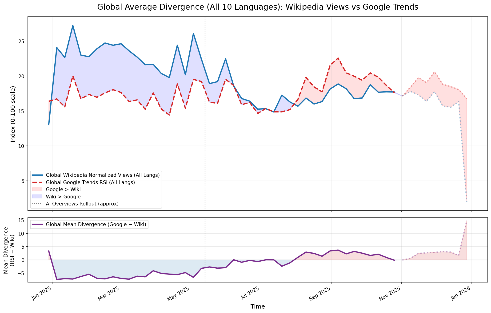
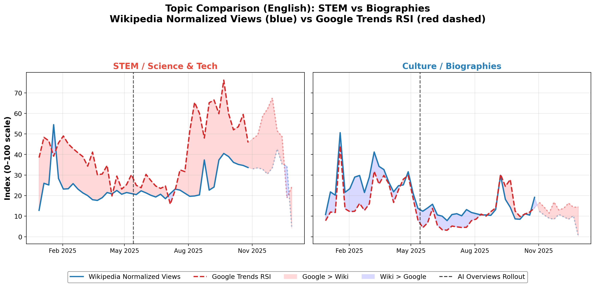

# Google vs Wikipedia — Trend Divergence Analysis

> Do Google's AI Overviews reduce Wikipedia traffic? A cross-language signal analysis across 10 Wikipedia editions.

## Overview

Following the global rollout of **Google AI Overviews** in May 2025, AI-generated answers now appear directly in search results — potentially reducing click-throughs to source websites like Wikipedia.

This project investigates whether that shift is measurable. We compare **Google Trends search interest** (RSI) with **Wikipedia pageview volumes** across the top 100 most-viewed articles in **10 language editions**, looking for divergence patterns that emerge after the AI Overviews rollout.

**Key finding:** Users are searching just as much (if not more), but they are no longer clicking through to Wikipedia — especially for STEM and factual topics where AI-generated answers are most effective.

## 📂 Project Structure

```
StandardDeviants_DataFest2026/
├── src/                                # Python scripts for analysis & plotting
│   ├── plot_google_trends_vs_wiki_pageviews.py   # Compare GT vs Wiki for individual articles
│   ├── plot_divergence_by_topic.py               # Divergence by fine-grained topic
│   ├── plot_divergence_by_topic_macro.py         # Divergence by macro topic category
│   ├── plot_overall_divergence.py                # Overall divergence (single language)
│   ├── plot_global_average_divergence.py         # Global average across all 10 languages
│   └── rescale_wikipageview_data.py              # Min-max rescale Google Trends CSVs
│
├── notebooks/                          # Jupyter notebooks for exploration
│   ├── 01_data_exploration_analysis.ipynb        # Data loading, cleaning, joining pipeline
│   └── 02_google_trends_api.ipynb                # SerpAPI-based Google Trends fetcher
│
├── outputs/                            # Generated visualizations
│   └── plots/
│       ├── by_language/                          # Per-language macro topic divergence
│       │   ├── de/                               #   German Wikipedia
│       │   ├── en/                               #   English Wikipedia
│       │   ├── fr/                               #   French Wikipedia
│       │   └── ru/                               #   Russian Wikipedia
│       └── combined/                             # Cross-language aggregate plots
│           ├── global_average_divergence.png
│           ├── divergence_all_languages.png
│           └── fig2_stem_vs_biography.png
│
├── docs/                               # Presentation materials
│   ├── DataFest_2026_Presentation.pptx
│   └── DataFest_2026_Presentation.pdf
│
├── .gitignore
├── .env.example
├── requirements.txt
├── LICENSE
└── README.md
```

## 🛠 Tech Stack


| Category | Tools |
|---|---|
| Data Processing | Polars, Pandas |
| Visualization | Matplotlib, Seaborn, Plotly |
| Google Trends API | SerpAPI (`google-search-results`) |
| Data Source | Wikimedia Analytics (pageviews, page info, edit history) |
| Notebooks | Jupyter |

## Setup & Installation

**1. Clone the repository**

```bash
git clone https://github.com/<your-username>/StandardDeviants_DataFest2026.git
cd StandardDeviants_DataFest2026
```

**2. Create a virtual environment**

```bash
python -m venv .venv
source .venv/bin/activate   # macOS/Linux
.venv\Scripts\activate      # Windows
```

**3. Install dependencies**

```bash
pip install -r requirements.txt
```

**4. Configure API key (optional — only needed for fetching new Google Trends data)**

```bash
cp .env.example .env
# Edit .env and add your SerpAPI key
```

**5. Download the Wikipedia dataset**

Run the first notebook to download and cache the Wikimedia datasets (~500 MB total):

```bash
jupyter notebook notebooks/01_data_exploration_analysis.ipynb
```

The notebook fetches data from `analytics.wikimedia.org` and builds normalized pageview CSVs for all 10 languages.

## Usage

### Full pipeline (notebooks)

The analysis flows through two notebooks in order:

```bash
# Step 1: Download data, normalize pageviews, join with Google Trends
jupyter notebook notebooks/01_data_exploration_analysis.ipynb

# Step 2: Fetch Google Trends data via SerpAPI (optional, cached data included)
jupyter notebook notebooks/02_google_trends_api.ipynb
```

### Individual plotting scripts

Each script in `src/` generates specific visualizations:

```bash
# Compare Google Trends vs Wikipedia for top articles (requires SerpAPI key)
python src/plot_google_trends_vs_wiki_pageviews.py --wiki enwiki --top 20 --skip-main

# Plot divergence by macro topic (STEM, Culture, Geography, etc.)
python src/plot_divergence_by_topic_macro.py

# Plot global average divergence across all 10 languages
python src/plot_global_average_divergence.py
```

### CLI options for the main comparison script

```
--wiki      Language edition (default: enwiki). Options: enwiki, dewiki, frwiki, ruwiki, etc.
--top       Number of top articles by pageviews (default: 10)
--titles    Specific page titles to analyze (overrides --top)
--api-key   SerpAPI key (or set SERPAPI_KEY env variable)
--skip-main Exclude the Main Page from the top list
```

## Results

### Global Divergence (All 10 Languages)

After the AI Overviews rollout (May 2025), Google Trends RSI increasingly exceeds Wikipedia pageviews — indicating that search interest remains high but fewer users click through to Wikipedia.

<p align="center">
  
</p>

### Topic-Level Impact: STEM vs Culture

STEM topics show a mean divergence of **+22.6 points** post-rollout — the largest gap of any category. Culture/Biography topics show minimal divergence (+0.36), suggesting AI Overviews primarily intercept factual, easily-summarizable queries.

<p align="center">
  
</p>

### Languages Analyzed

| Language | Wiki Code | Articles | Topic Coverage |
|---|---|---|---|
| English | `enwiki` | 100 | STEM, Culture, Geography, History |
| German | `dewiki` | 100 | STEM, Culture, Geography |
| French | `frwiki` | 100 | Culture, Geography |
| Russian | `ruwiki` | 100 | STEM, Culture, Geography |
| Spanish | `eswiki` | 100 | All categories |
| Swedish | `svwiki` | 100 | All categories |
| Dutch | `nlwiki` | 100 | All categories |
| Italian | `itwiki` | 100 | All categories |
| Arabic | `arwiki` | 100 | All categories |
| Polish | `plwiki` | 100 | All categories |

## Limitations & Future Scope

**Limitations:**

- Google Trends RSI is a relative index (0–100), not absolute search volume — direct magnitude comparisons require caution
- The analysis uses the top 100 articles per language, which skews toward high-traffic pages and may not represent long-tail content
- Temporal alignment between Google Trends weekly buckets and Wikipedia daily pageviews introduces minor aggregation noise
- The AI Overviews rollout date is approximate and varied by region

**Future directions:**

- Extend the analysis to include click-through rate (CTR) data from Google Search Console where available
- Incorporate edit activity data to study whether reduced traffic also impacts editor engagement
- Apply causal inference methods (difference-in-differences, synthetic control) for more rigorous impact estimation
- Track divergence trends over a longer post-rollout window as AI Overviews expand to more queries and regions

## 👥 Author

**Team Standard Deviants** — DataFest 2026, Universität Mannheim

| Name | Role |
|---|---|
| Manjunath Reddy | Data pipeline, API integration, visualization |
| Sumanth | Data pipeline, API integration, visualization |

- 🎓 Universität Mannheim
- 🎓 TU Darmstadt

---